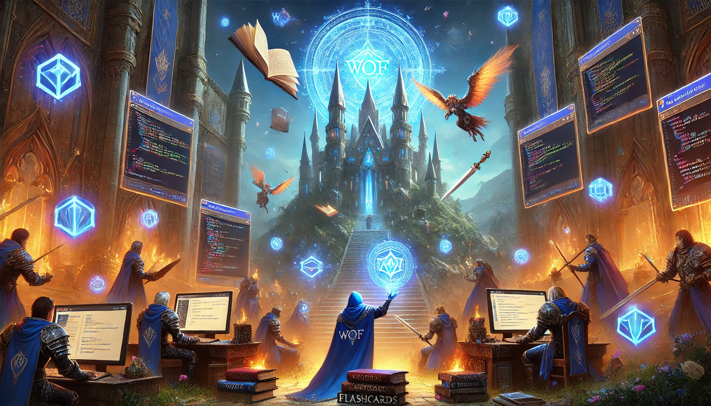

# World of Flashcards

Bienvenue dans World Of Flashcards (WOF), un environnement dans lequel vous allez apprendre puis démontrer votre maîtrise du framework [AdonisJS](https://adonisjs.com/) !

Vous y serez accompagné par votre prof non joueur (PnJ) auquel vous pourrez demander conseil et assistance, et à qui vous remettrez vos quêtes achevées pour qu'il vous attribue les points d'expérience (px) qui vous feront gagner des niveaux.

Avant toute chose, écoutez-le vous guider à travers le processus de configuration...

Et foncez dans le tas ...

## Configuration d'une partie de WOF

### Préparation (prof)

- Tous les élèves ont un compte sur l'infra IceScrum ETML (https://etml.icescrum.com) et __pas__ sur le IceScrum public (https://www.icescrum.com/). Leur nom d'utilisateur doit permettre de les identifier sans ambiguité (p.ex: `Lucas 2` n'est pas OK)
- Importe le projet `wofmaster.zip` dans IceScrum. Tu vas devoir donner une nouvelle clé de projet, car elle existe déjà. Attention: 10 caractères max, que des chiffres ou des lettres.
- Juste pour éviter les confusions: personnalise le nom du projet (p. ex. avec tes initiales)
- Dans les settings du projet, crée une nouvelle équipe qui contient tout tes élèves et associe-là au projet. C'est cela qui permettra aux élèves de venir chercher leurs quêtes.

### Installation (PnJ+joueurs)

1. Tous: allez sur le repo Wof sur [Github](https://github.com/ETML-INF/WOF) (pas besoin de se connecter)
2. Tous: Téléchargez le ZIP de ce repo (sous `Code`)
3. Tous: Extrayez le dossier `WOF-main` de ce zip et placez-le dans vos dossiers de travail sous le nom de `WOF` 
4. Tous: Connectez-vous à https://etml.icescrum.com
5. Joueurs: Créez un projet dans IceScrum avec
    - Nom de projet: `WOF - III`, où `III` sont vos initiales (p.ex: `GBY` pour Gérard Bellamy)
    - Clé de projet: `WOFIIIXXXX`, où `III` sont vos initiales et `YYYY` est l'année scolaire en cours. Exemple: `WOFGBY2024`, même en février 2025 vu que l'année scolaire a débuté en 2024. Notez cette clé, vous allez en avoir besoin plus loin.
    - Vous seul en tant qu'équipe dans `Team and projects members`
    - Votre prof en tant que Product Owner. C'est cela qui lui permettra de vous donner vos px.
    - La case `Disable Estimation` est cochée dans `Project Configuration > Practices`
    - La date de début du projet est la date de début du trimestre
    - L'état `In Review` est activé dans `Project Configuration > Story Workflow`
    - Une Release `MAIN` dont les dates couvrent le trimestre entier
    - Un sprint **activé** qui dure toute la release
6. PnJ: Collecte toutes les clés de projets créées par les joueurs
7. Tous: dans les détails de votre compte IceScrum (cliquez sur l'avatar, puis MyAccount > Account), sélectionnez l'onglet `API tokens`. Créez un token nommé 'WOF', copiez-le dans le presse-papier
8. Quittez IceScrum et ouvrez le dossier WOF
9. Joueurs: 
    - Ouvrez le fichier `Player Config.html`.
    - Collez le token que vous venez de mettre dans le presse-papier
    - Saisissez la clé de projet (`WOFGBY2024`)
    - Saisissez la clé du projet de votre PnJ
    - Téléchargez le fichier de configuration
    - Déplacez-le dans votre dossier WOF
10. PnJ:
    - Renomme `config.js.example` en `config.js`
    - Colle ton token dans le fichier
    - Place toutes les clés de projet dans le tableau `playersProjectIds`

Votre configuration est achevée si vous obtenez quelque chose comme ceci en ouvrant le fichier `Player.html`

